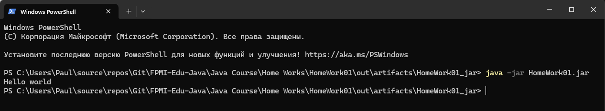

# Домашняя работа №1

Основы java платформы.

1. запустить программу Hello world через идею
2. скомпилировать и запустить программу Hello world через javac java
3. собрать jar архив с программой Hello world и запустить его
4. выложить Hello world и jar на гит, прислать ссылку

## Решение

Код программы:

```java
public class Main {
    public static void main(String[] args) {
        System.out.println("Hello world");
    }
}
```

Вывод в консоль:

